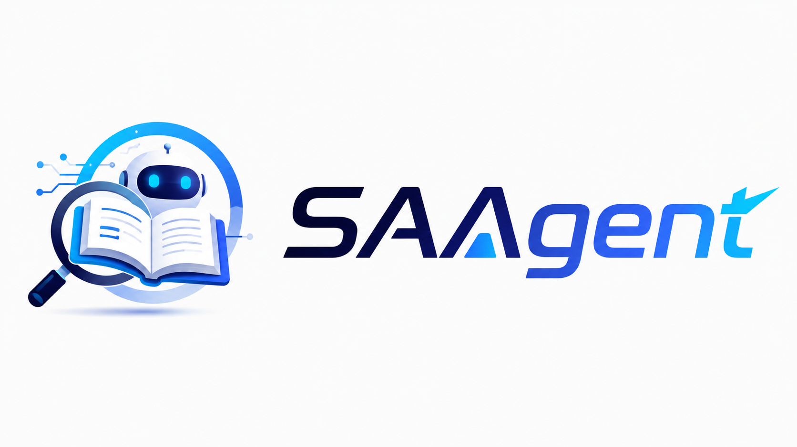

<div align="center">
  



“精确即是艺术”

# SuperAcademicAgent

**二十分钟，从零成为领域专家**

像人类专家一样调研 | 考据真实数据无幻觉 | 研究脉络解析 | 最精确的重点论文定位 | 交互式CLI


  


</div>

---

## 致谢

感谢两位核心贡献者：

- [@CYFang6](https://github.com/CYFang6)
- [@yihengjingWHU](https://github.com/yihengjingWHU)

---

## 为什么做这个

AI 浪潮下论文呈指数级增长——一个细分方向半年就能冒出几十篇新工作。对想进入新领域的人：

- **找不到源头**：分不清哪篇是真正的奠基作
- **理不清脉络**：引用关系盘根错节，看不出主线
- **追不上前沿**：最新论文还没被引用、没被索引，传统工具搜不到
- **不知从哪读起**：不知道该按什么顺序读、先补什么

**SuperAcademicAgent 把这件事压缩成一条命令。**

---

## 它能给你什么

给它一个研究方向、一篇论文（标题 / DOI / arXiv 链接）、或一段模糊描述。
它会给你验证可用的调研报告，杜绝了ai搜索的乱搜，多搜等情况，给你完美的报告。

| 产出 | 说明 |
|------|------|
| 🌱 奠基论文 | 这个领域从哪几篇开始 |
| 🕸️ 引用网络 | 真实引用关系构建的图（非关键词匹配） |
| 🛣️ 演进路线图 | 从源头 → 经典 → 最新前沿，标出范式突破/改进/分支 |
| 📌 你所查的论文 | 这篇论文在领域中的位置——在主干上还是分支？和主干什么关系？ |
| 📖 入门综述 | 大白话 tldr、核心思想、前置知识、关键术语、上手路径 |
| 📰 报纸式可视化 | 一份可离线分享的精美单页 HTML |

### 与众不同的地方

- **自主探索**：AI agent 自己决定检索什么、往哪扩、读哪篇；拿不准时带选项问你
- **真的读论文**：会精读 arXiv 全文来判断谁是奠基、谁重要（不只看标题和引用数）
- **够得到前沿**：能把刚发出来、还没人引用的论文也织进脉络
- **不丢你的论文**：以你查询的论文为起点，明确分析它在领域中的位置和与主干的关系
- **不配 AI 也能跑**：没有大模型时自动降级到纯图算法 pipeline
- **对话中可调参**：输出目录、图谱规模、语言等都可以在对话中用自然语言随时调整

---

## 示例

[`examples/opsd_view.html`](examples/opsd_view.html) — 查询 "on-policy self-distillation for LLMs" 的完整报纸式产出，下载后双击即可查看。

---

## 快速开始

### 1. 安装（Python 3.12+）

```bash
uv venv --python 3.12 .venv && source .venv/bin/activate
pip install -e .
```

### 2. 配置（`~/.saagent.env`）

这个文件必须存在（可以为空）。不配大模型时自动走纯图算法；配了则使用 AI agent 自主探索。

**阿里云百炼（推荐，免费额度充足）：**
```bash
SAAS_LLM_PROVIDER=bailian
DASHSCOPE_API_KEY=sk-你的key
SAAS_BAILIAN_MODEL=qwen3.7-max
```

**Anthropic 兼容网关：**
```bash
SAAS_LLM_PROVIDER=claude
ANTHROPIC_BASE_URL=https://your-gateway.com/api
ANTHROPIC_AUTH_TOKEN=你的token
SAAS_LLM_MODEL=claude-sonnet-4-20250514
```

**本地模型（vLLM / Ollama）：**
```bash
SAAS_LLM_PROVIDER=local
SAAS_LOCAL_BASE_URL=http://localhost:8001/v1
SAAS_LOCAL_MODEL=qwen3-8b
```

**不配大模型：**
```bash
touch ~/.saagent.env   # 空文件即可，走纯图算法
```

**数据源（可选，配了更快更稳）：**
```bash
OPENALEX_API_KEY=你的key    # 免费申请：https://openalex.org/users/me
S2_API_KEY=你的key           # Semantic Scholar，修正引用数
```

### 3. 运行

```bash
# 直接进入交互式 CLI（推荐）
saagent

# 带上问题直接开始
saagent "attention is all you need"

# 指定输出目录
saagent "attention is all you need" --out ./results/demo

# 恢复上次中断的会话
saagent --resume
```

```bash
# 一次性运行（适合脚本/批量/CI，跑完自动退出）
saagent run "attention is all you need" --out ./results/demo --no-ask

# DOI / arXiv id 也认：
saagent run "10.48550/arXiv.1706.03762" --out ./results/demo --no-ask
```

### 4. 看结果

```bash
open ./examples/opsd_view.html
```

输出目录包含：

| 文件 | 内容 |
|------|------|
| `view.html` | 报纸式可视化（双击打开，支持中英切换） |
| `report.md` | Markdown 文字报告 |
| `result.json` | 完整结构化数据 |
| `citation_network.graphml` | 引用网络（可导入 Gephi / Cytoscape） |
| `roadmap.graphml` | 路线图 DAG |
| `trace.log` | agent 决策轨迹 |

---

## 两种模式

| | `saagent`（chat） | `saagent run` |
|---|---|---|
| 交互方式 | 持久会话，多轮对话 | 一次性，跑完退出 |
| 适合场景 | 日常探索、追问、精读 | 脚本、批量、CI |
| 图谱增长 | 跨轮累积 | 单次 |
| 会话恢复 | `--resume` 支持 | 不支持 |
| 自然语言改配置 | 支持 | 不支持 |
| 无 LLM | 不支持（需要 LLM） | 自动降级为 pipeline |

---

## 参数

### `saagent [query]`（交互模式）

| 参数 | 默认值 | 说明 |
|------|--------|------|
| `query` | 无 | 首个研究问题（可启动后再输入） |
| `--out DIR` | `~/.saagent/sessions/<时间戳>/` | 会话输出目录 |
| `--resume` | — | 恢复上次中断的会话 |
| `--max-nodes N` | 60 | 引用网络节点上限 |
| `--max-turns N` | 60 | agent 单轮最大推理步数 |
| `--model NAME` | .env 配置 | 覆盖模型名 |
| `--lang zh\|en` | zh | agent 交互语言 |
| `--no-translate` | off | 跳过中文翻译 |

### `saagent run <query>`（一次性运行）

| 参数 | 默认值 | 说明 |
|------|--------|------|
| `--out DIR` | `./results/agent_run` | 结果输出目录 |
| `--no-ask` | off | 关掉歧义追问，全自动 |
| `--max-nodes N` | 60 | 引用网络节点上限 |
| `--depth N` | 2 | 扩图深度（pipeline 模式） |
| `--max-turns N` | 60 | agent 最大推理轮数 |
| `--model NAME` | .env 配置 | 覆盖模型名 |
| `--lang zh\|en` | zh | agent 交互语言 |
| `--no-translate` | off | 跳过中文翻译 |

### 对话中的自然语言指令

在交互模式中，你可以直接用自然语言调整配置，无需重启：

| 说什么 | 效果 |
|--------|------|
| "把结果放到 ./results/demo" | 修改输出目录（已有产出自动复制过去） |
| "最大 50 篇" | 修改 max_nodes |
| "用英文" | 切换 agent 交互语言 |
| "不要翻译" | 关闭中文翻译 |
| "当前配置是什么" | 查看输出目录、模型、参数 |

### 斜杠命令与快捷键

| 命令/快捷键 | 作用 |
|-------------|------|
| `/new` | 开始新的研究方向（清空当前图谱） |
| `/quit` | 退出 |
| `/help` | 完整帮助 |
| `Ctrl+O` | 展开/折叠工具输出详情 |
| `Ctrl+C` | 中断当前任务 / 退出 |

---

## 数据与隐私

- 数据来自 **OpenAlex**（2.5 亿+ 论文的真实引用）和 **arXiv**（最新前沿），均为公开学术数据
- API key 都可选——不填也能匿名跑
- 密钥只存在本地的 `~/.saagent.env`，不会上传

---

## 技术架构

```
saagent / saagent run
         │
         ▼
┌─────────────────┐       ┌──────────────────┐
│ Stirrup Agent   │──────▶│ Tools (14 个)     │
│ Loop (LLM)      │       │ seeds / graph /   │
│                 │       │ read / analysis / │
│ done/emit_result│       │ config / notes    │
└─────────────────┘       └────────┬─────────┘
         │                         │
         ▼                         ▼
┌─────────────────┐       ┌──────────────────┐
│ Engine Core     │       │ Data Sources     │
│ (algorithms)    │       │ · OpenAlex       │
│ · graph metrics │       │ · arXiv (PDF)    │
│ · founding      │       │ · Semantic Sch.  │
│ · roadmap       │       └──────────────────┘
│ · report        │
│ · seed analysis │
└─────────────────┘
         │
         ▼
┌─────────────────┐
│ Export           │
│ · result.json   │
│ · view.html     │
│ · report.md     │
│ · graphml       │
└─────────────────┘
```

**Agent 工具集**：
- `find_candidates` / `add_seed` — 双源检索 + 种子锚定
- `expand_forward` / `expand_backward` / `expand_frontier` — 引用图扩展
- `graph_search` / `search_recent` / `mine_surveys` — 补充检索
- `read_paper` / `read_local_pdf` / `link_frontier` — 全文精读 + 前沿连接
- `find_founding` / `select_roadmap` / `write_report` — 分析三步
- `get_config` / `set_config` / `set_output_dir` — 运行时配置
- `take_note` / `export_notes` — 精读笔记
- `ask_user` — 歧义消解
- `emit_result` / `done` — 结束工具

**引擎核心算法**：PageRank / betweenness / velocity 指标、实体去重、年份自愈、相关性标注（core/related/off-topic）、噪声剪枝、Semantic Scholar 引用数校正

**数据源**：OpenAlex（2.5 亿论文引用骨架） + arXiv（前沿全文 PDF） + Semantic Scholar（引用数修正）

---

## 状态

可端到端运行。持续优化中。
